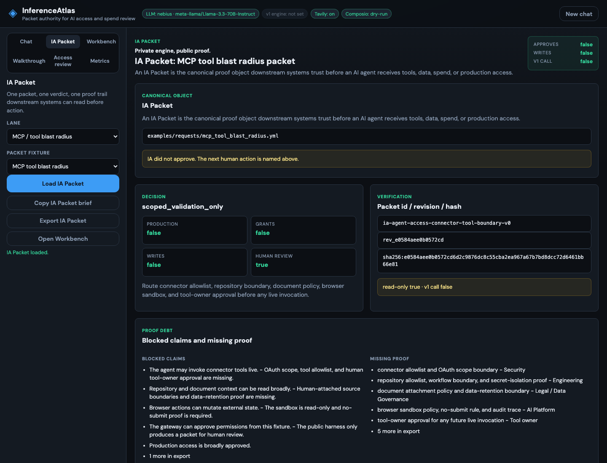
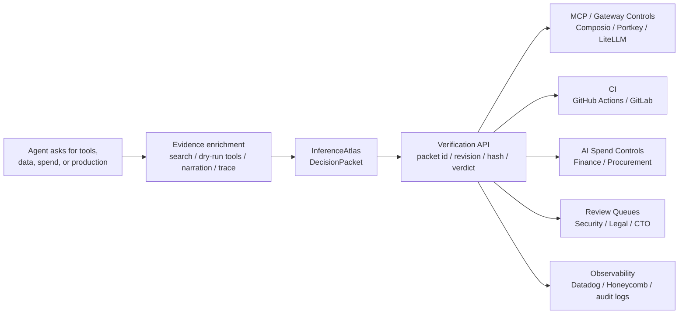

# InferenceAtlas — Public Agent-Access Review Harness

Private engine, public proof.

Every agent demo shows the agent taking action. InferenceAtlas shows the proof packet before an agent is allowed to act.




InferenceAtlas turns an agent's request for tools, data, spend, or production access into a DecisionPacket before anything moves.
Downstream systems do not trust raw agent intent. They trust the IA packet: packet id, revision, hash, verdict, proof debt, reviewer routing, and blocked claims.
AI movement is cross-functional. IA turns every team's proof into one packet downstream systems can trust.

This repo is the Hack the High Seas public proof surface. It is not a private v1 code dump.

This public harness does not approve access.

## 60-Second Review Path
```bash
bash scripts/review_60.sh
```
Opens `/packet?fixture=mcp_tool_blast_radius&autorun=1`: one public fixture becomes one IA Packet with verdict, proof debt, Sponsor Proof Trace, downstream consumers, verification hash, and export-ready review brief. Switch fixtures inside the IA Packet surface to inspect access, spend, admin, MCP, and supply-chain lanes. No keys required, dry-run by default, no v1 calls.

## Why It Exists

Agents can request access faster than security, finance, procurement, and production review processes can keep up.

InferenceAtlas creates the pre-permission packet humans and downstream systems need before tools, data, spend, or production access moves.

## Why Now

- [AI spend](examples/generated/ai_spend_budget_overrun.spend_packet.md) is becoming a governance problem: teams need proof before model usage, vendor spend, or savings claims move.
- [Agent tool access](docs/LIVE_INTEGRATION_CONTRACT.md) is expanding through connectors, sandboxes, and managed-agent systems, which increases blast radius.
- [Supply-chain incidents](docs/case_studies/MIASMA_PRE_PERMISSION_PACKET.md) show why install, publish, CI, and credential-bearing scope need pre-permission review.

## Who Uses It

- AI platform and CTO teams deciding whether an agent can enter scoped validation.
- Security and Legal teams reviewing tool scopes, data classes, proof debt, and blocked claims.
- Finance and Procurement teams reviewing AI spend, vendor changes, caps, and savings claims.
- Gateway, CI, review, and observability owners who need a packet reference before letting automation proceed.

## Upstream Packet Authority

InferenceAtlas is the packet authority layer upstream of tools, gateways, spend controls, CI, and human review.



## Review Paths

- Run the Packet Workbench product path: `bash scripts/review_60.sh`
- Ask the packet like a gateway: `python3 -m agent.packet_advisor --fixture ai_spend_budget_overrun --subscriber portkey_model_spend_gate --question "Can Portkey allow this spend?" --json`
- Preview the Portkey dry-run gate: `python3 -m agent.portkey_adapter --fixture ai_spend_budget_overrun --mode dry-run --json`
- Read the walkthrough: [Product Tour](docs/PRODUCT_TOUR.md)
- Inspect the contract: [Public Conformance Contract](docs/CONTRACT.md)
- Map the capability surface: [Agent Skills](docs/AGENT_SKILLS.md)

Deep references: [Judge Review Guide](docs/JUDGE_REVIEW_GUIDE.md), [Agentic Review Expected Output](docs/AGENTIC_REVIEW_EXPECTED_OUTPUT.md), [Demo Recording Script](docs/DEMO_RECORDING_SCRIPT.md), [Command Reference](docs/COMMAND_REFERENCE.md), [Artifact Map](docs/ARTIFACT_MAP.md), [Product Quality Audit](docs/PRODUCT_QUALITY_AUDIT.md), [CTO Handoff](docs/CTO_HANDOFF.md), [Architecture](docs/ARCHITECTURE.md), [Live Integration Contract](docs/LIVE_INTEGRATION_CONTRACT.md), [Proof Health](examples/generated/support_triage_agent.proof_health.md), [V1 Capability Passport](docs/V1_CAPABILITY_PASSPORT.md), and [Agent Reviewer Instructions](AGENTS.md).

CLI fallback: `bash scripts/run.sh` stays offline, deterministic, dry-run, and no-write.

Private engine, public proof.
