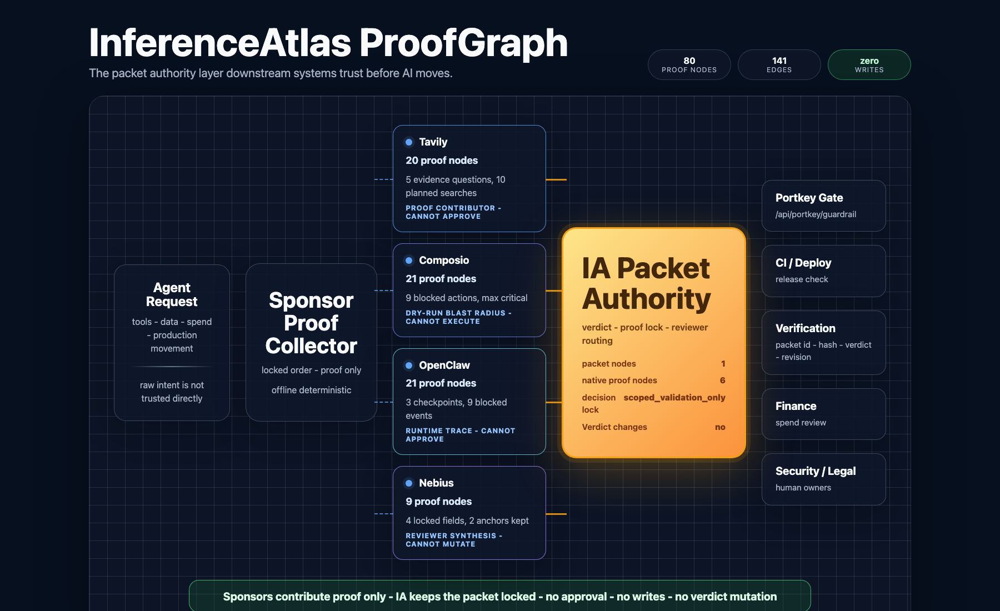
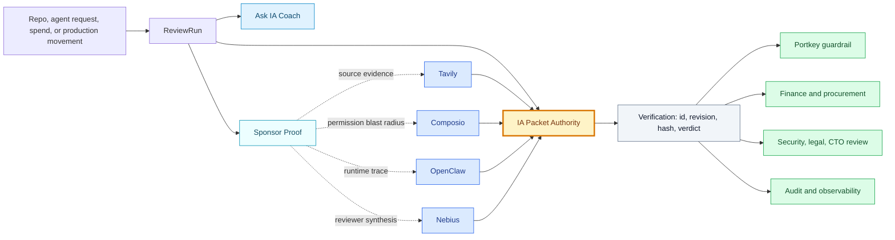

# InferenceAtlas

### The packet authority layer before AI moves.

Private engine, public proof.



Generated from a public packet. Every ReviewRun emits its own ProofGraph.

`zero writes` · `public contract v0` · `sponsor proof wired` · `Portkey guardrail path`

AI agents are getting repos, tools, budgets, models, and production paths faster than approval systems can keep up.

Every agent demo shows the agent taking action. InferenceAtlas shows the proof packet before an agent is allowed to act.

InferenceAtlas turns every AI movement request into one reviewable packet: what can move, what stays blocked, what proof is missing, who must review it, and what downstream gates like Portkey should enforce.
Downstream systems do not trust raw agent intent. They trust the IA Packet.
AI movement is cross-functional. IA turns every team's proof into one packet downstream systems can trust.

## Ship Builder Judge Deck

Share the cinematic PDF when you want the fastest public read of the product story:

[InferenceAtlas Ship Builder Cinematic Judge Deck](docs/ship_builder/InferenceAtlas_Ship_Builder_Cinematic_Judge_Deck.pdf)

The deck frames InferenceAtlas as portable approval receipts for AI movement: GitHub hashes code; IA hashes the decision to move; Portkey consumes the packet-backed verdict; ProofGraph shows why the decision changed.

## Try It In 60 Seconds

```bash
python3 -m web
python3 scripts/review_run_rehearsal_gate.py --base-url http://127.0.0.1:8080
```

Open `http://127.0.0.1:8080` for the visual path.

The rehearsal gate checks the recording loop: connect or use a demo repo, generate the ReviewRun packet, ask IA for the next action, attach human proof, rerun the packet, test the Portkey guardrail handoff, open the dynamic ProofGraph, and confirm the review brief is export-ready.

No keys are required for the public path. No approval, no external writes, no packet mutation, no Portkey policy mutation.

## The Loop

```text
Connect repo
-> Generate IA Packet
-> Ask IA explains proof debt
-> Attach human proof
-> Rerun packet
-> Portkey reads the packet verdict
-> ProofGraph shows the authority path
-> Export review brief
```

The important point is simple: raw agent intent is not trusted directly. The packet is the authority object humans and downstream systems can inspect before movement.

## Why It Exists

Agents can request access faster than security, finance, procurement, and production review processes can keep up.

InferenceAtlas creates the pre-permission packet humans and downstream systems need before tools, data, spend, or production access moves.

## Why Now

- [AI spend](examples/generated/ai_spend_budget_overrun.spend_packet.md) is now budgeted, metered, and governed. Teams need proof before model usage, vendor spend, or savings claims move.
- [Agents need identities, permissions, containment, and audit trails](https://www.businessinsider.com/satya-nadella-microsoft-how-to-manage-ai-agents-human-employees-2026-6). Access review has to happen before agents reach sensitive systems.
- [Gateways need verdicts they can trust](https://docs.portkey.ai/docs/integrations/guardrails/bring-your-own-guardrails). Portkey's BYO guardrail shape lets a packet-backed endpoint return a verdict without trusting raw prompt intent.
- [AI infrastructure spend is becoming a financing and procurement layer](https://www.apollo.com/insights-news/pressreleases/2026/06/apollo-leads-35-billion-capital-solution-for-broadcom-ai-xpv-platform-in-partnership-with-blackstone-and-leading-global-banks-3308896). Governance has to work across models, vendors, budgets, and gateways.

## Who Uses It

- AI platform and CTO teams deciding whether an agent can enter scoped validation.
- Security and Legal teams reviewing tool scopes, data classes, proof debt, and blocked claims.
- Finance and Procurement teams reviewing AI spend, vendor changes, caps, and savings claims.
- Gateway, CI, review, and observability owners who need a packet reference before letting automation proceed.

## How IA Works



## Blast Radius ProofGraph

Every ReviewRun emits a packet-bound ProofGraph: the repo, requested agent movement, sponsor proof, blocked claims, reviewer gates, and downstream guardrails all resolve back to one IA Packet.

In this public proof surface, the graph is generated from safe ReviewRun state and public fixtures.

In v1, the same graph expands across private customer context: real tool grants, workspace policy, reviewer systems, usage budgets, production routes, and audit trails.

## Sponsors And Downstream

- **Tavily** adds source evidence.
- **Composio** shows permission blast radius and dry-run tool planning.
- **OpenClaw** records runtime trace and blocked action shape.
- **Nebius** synthesizes reviewer-ready context over locked packet fields.
- **Portkey** consumes the packet verdict through a BYO guardrail path.

Sponsors contribute proof only. They do not approve, grant, write, spend, select providers, mutate packets, or replace human review.

## Public Proof Surface, Private Engine

This repository is not a v1 source dump.
This repository is the public proof surface, not a private v1 code dump.
This public harness does not approve access.

It demonstrates the public packet authority contract: repo context, access request, proof debt, reviewer routing, Portkey guardrail handoff, ProofGraph, and zero-write safety boundaries.

InferenceAtlas v1 extends the same contract across:

- private policy and risk surface
- reviewer workflows and approval routing
- live customer environment context
- production-grade integrations

## Documentation

- **Start:** [Command Reference](docs/COMMAND_REFERENCE.md), [Demo Recording Script](docs/DEMO_RECORDING_SCRIPT.md), and [90-Second Demo Script](docs/DEMO_90_SECOND_SCRIPT.md)
- **Understand:** [Public Conformance Contract](docs/CONTRACT.md)
- **Integrate:** [Live Integration Contract](docs/LIVE_INTEGRATION_CONTRACT.md)
- **Deep proof:** [Product Tour](docs/PRODUCT_TOUR.md), [Product Quality Audit](docs/PRODUCT_QUALITY_AUDIT.md), [Agent Skills](docs/AGENT_SKILLS.md), and [Artifact Map](docs/ARTIFACT_MAP.md)
- **CTO path:** [CTO Handoff](docs/CTO_HANDOFF.md), [Architecture](docs/ARCHITECTURE.md), and [Proof Health](examples/generated/support_triage_agent.proof_health.md)
- **Automated reviewer path:** [Judge Review Guide](docs/JUDGE_REVIEW_GUIDE.md), [Agentic Review Expected Output](docs/AGENTIC_REVIEW_EXPECTED_OUTPUT.md), and [Agent Reviewer Instructions](AGENTS.md)

Advanced surface: Packet Workbench remains available for deterministic fixture inspection at `/workbench`.
Legacy packet fixture review remains available with `bash scripts/review_60.sh`, which opens `/packet?fixture=mcp_tool_blast_radius&autorun=1`.

CLI fallback:

```bash
bash scripts/run.sh
```

InferenceAtlas does not approve access, mutate packets, or push downstream policy.

The packet is the authority. Humans review. Downstream gates enforce.
