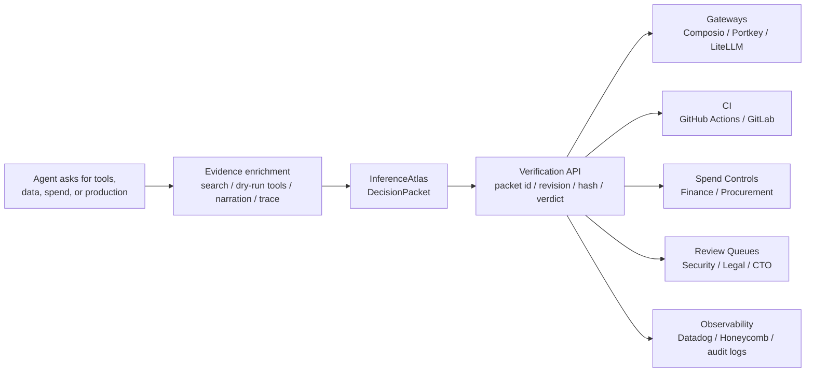

# InferenceAtlas — Public Agent-Access Review Harness

Private engine, public proof.

Every agent demo shows the agent taking action. InferenceAtlas shows the proof packet before an agent is allowed to act.


InferenceAtlas turns an agent's request for tools, data, spend, or production access into a DecisionPacket before anything moves.
Downstream systems do not trust raw agent intent. They trust the IA packet: packet id, revision, hash, verdict, proof debt, reviewer routing, and blocked claims.

This repo is the Hack the High Seas public proof surface. It is not a private v1 code dump.

This public harness does not approve access.

## 60-Second Review Path
```bash
bash scripts/review_60.sh
```
CLI judge fallback: `bash scripts/run.sh`.
Opens `/workbench?fixture=mcp_tool_blast_radius&autorun=1`: one public fixture becomes one DecisionPacket, one locked Sponsor Proof Trace, one verification hash, and one export-ready review brief. No keys required, dry-run by default, no v1 calls.

## Judge Fast Path
`bash scripts/run.sh` stays the CLI-only offline, deterministic, dry-run, no-write fallback.

## Why It Exists

Agents can request access faster than security, finance, procurement, and production review processes can keep up.

InferenceAtlas creates the pre-permission packet humans and downstream systems need before tools, data, spend, or production access moves.

## Why Now

- [AI spend](examples/generated/ai_spend_budget_overrun.spend_packet.md) is becoming a governance problem: teams need proof before model usage, vendor spend, or savings claims move.
- [Agent tool access](docs/LIVE_INTEGRATION_CONTRACT.md) is expanding through connectors, sandboxes, and managed-agent systems, which increases blast radius.
- [Supply-chain incidents](docs/case_studies/MIASMA_PRE_PERMISSION_PACKET.md) show why install, publish, CI, and credential-bearing scope need pre-permission review.

## Who Uses It

- AI platform and CTO teams deciding whether an agent can enter scoped validation.
- Security and Legal teams reviewing tool scopes, data classes, proof debt, and blocked claims.
- Finance and Procurement teams reviewing AI spend, vendor changes, caps, and savings claims.
- Gateway, CI, review, and observability owners who need a packet reference before letting automation proceed.

## Upstream Packet Authority

InferenceAtlas is the packet authority layer upstream of tools, gateways, spend controls, CI, and human review.



## Review Paths

- Packet Workbench / 60-second reviewer path: run `bash scripts/review_60.sh` or read [Review 60 Path](docs/REVIEW_60_PATH.md)
- Product walkthrough: [Product Tour](docs/PRODUCT_TOUR.md)
- Capability map: [Agent Skills](docs/AGENT_SKILLS.md)
- Fast reviewer guide: [Judge Review Guide](docs/JUDGE_REVIEW_GUIDE.md)
- AI/coding-agent review: [Agent Reviewer Instructions](AGENTS.md) and [Agentic Review Expected Output](docs/AGENTIC_REVIEW_EXPECTED_OUTPUT.md)
- Product-quality guardrail: [Product Quality Audit](docs/PRODUCT_QUALITY_AUDIT.md)
- Commands after the one-run path: [Command Reference](docs/COMMAND_REFERENCE.md)
- Artifact map: [Artifact Map](docs/ARTIFACT_MAP.md)
- Public contract: [Public Conformance Contract](docs/CONTRACT.md) and [Safety Contract](docs/SAFETY_CONTRACT.md)
- CTO/build handoff: [CTO Handoff](docs/CTO_HANDOFF.md), [Architecture](docs/ARCHITECTURE.md), and [Live Integration Contract](docs/LIVE_INTEGRATION_CONTRACT.md)
- Lifecycle signal: [Proof Health](examples/generated/support_triage_agent.proof_health.md)
- Private boundary map: [V1 Capability Passport](docs/V1_CAPABILITY_PASSPORT.md)

Private engine, public proof.
