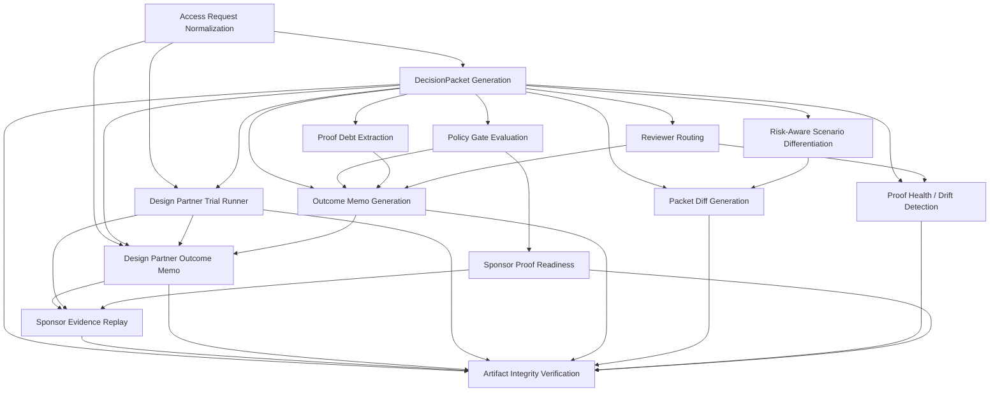

# Agent Skills

Status: generated public capability registry
Purpose: show which public review skills the harness exposes, what proves each skill, and which safety boundary applies

Private engine, public proof.

This document is generated from `agent/skills.py`. Regenerate it with:

```bash
python3 -m scripts.generate_agent_skills_doc
```

## Summary

- Registered skills: `14`
- Stable skills: `14`
- Public harness approves access: `false`
- Public harness grants permissions: `false`
- Public harness executes external writes: `false`

## Skills Matrix

### Agent Access Review

| Skill | Tier | What it proves | Command | Primary artifacts | Safety boundary |
| --- | --- | --- | --- | --- | --- |
| Access Request Normalization | `stable` | Messy role-level YAML maps to a structured public access-review input. | `python3 -m agent.trial examples/requests/support_triage_trial.yml --json` | `agent/access_request.py`<br>`agent/trial.py`<br>`examples/requests/support_triage_trial.yml` | no secrets accepted; role-level only |
| DecisionPacket Generation | `stable` | A structured access request becomes a schema-backed packet with scope, proof debt, reviewers, and safety state. | `python3 -m agent.review --scenario support_triage_agent --artifact packet --format json` | `agent/packet.py`<br>`schemas/decision_packet.schema.json`<br>`examples/generated/support_triage_agent.packet.json` | no production-access claim; never approves |
| Policy Gate Evaluation | `stable` | Public policy rules block critical, admin, and prod-write scope before validation moves. | `python3 -m agent.gate --all` | `agent/gate.py`<br>`policy/agent_access.yml` | read-only; humans approve |
| Proof Debt Extraction | `stable` | Missing evidence and unsupported claims stay visible as reviewer work. | `python3 -m agent.review --scenario support_triage_agent --artifact packet --format json` | `agent/rules.py`<br>`examples/generated/support_triage_agent.packet.json` | no complete claim without verified evidence |
| Reviewer Routing | `stable` | Review owners and action items are derived from the packet instead of hidden in prose. | `python3 -m agent.review --scenario support_triage_agent --artifact brief --format json` | `agent/rules.py`<br>`examples/generated/support_triage_agent.decision_brief.json` | routing is recommendation; never dispatches |
| Risk-Aware Scenario Differentiation | `stable` | Low, medium/high, and critical requests produce materially different review postures. | `python3 -m agent.review --list` | `agent/scenarios.py`<br>`examples/generated/read_only_analytics_agent.packet.json`<br>`examples/generated/support_triage_agent.packet.json`<br>`examples/generated/admin_code_fix_bot.packet.json` | read-only; humans approve |

### Design Partner Pilot

| Skill | Tier | What it proves | Command | Primary artifacts | Safety boundary |
| --- | --- | --- | --- | --- | --- |
| Sponsor Evidence Replay | `stable` | Sponsor proof slots attach to a trial decision while verdict, approvals, grants, writes, and production mutation stay locked. | `python3 -m agent.trial_evidence_replay examples/requests/support_triage_trial.yml` | `agent/trial_evidence_replay.py`<br>`examples/generated/support_triage_trial.evidence_replay.md`<br>`examples/generated/support_triage_trial.evidence_replay.json` | dry-run by default; no live writes; sponsor cannot grant access |
| Design Partner Outcome Memo | `stable` | A trial request becomes a meeting-ready decision with can-move scope, blocked scope, proof owners, and reviewer routes. | `python3 -m agent.trial_outcome_memo examples/requests/support_triage_trial.yml` | `agent/trial_outcome_memo.py`<br>`examples/generated/support_triage_trial.outcome_memo.md`<br>`examples/generated/support_triage_trial.outcome_memo.json` | memo restates blocked claims; never grants access |
| Design Partner Trial Runner | `stable` | A role-level trial request becomes a report, packet, and access brief without live credentials. | `python3 -m agent.trial examples/requests/support_triage_trial.yml` | `agent/trial.py`<br>`examples/requests/support_triage_trial.yml`<br>`examples/generated/support_triage_trial_report.md`<br>`examples/generated/support_triage_trial.packet.json`<br>`examples/generated/support_triage_trial.decision_brief.json` | no live integration path; humans review |

### Packet Lifecycle

| Skill | Tier | What it proves | Command | Primary artifacts | Safety boundary |
| --- | --- | --- | --- | --- | --- |
| Outcome Memo Generation | `stable` | The packet becomes a concise human decision surface for what can move and what stays blocked. | `python3 -m agent.outcome_memo` | `agent/outcome_memo.py`<br>`examples/generated/support_triage_agent.outcome_memo.md`<br>`examples/generated/support_triage_agent.outcome_memo.json` | memo restates blocked claims; never grants access |
| Packet Diff Generation | `stable` | Scenario packets expose load-bearing differences across risk levels. | `python3 -m agent.packet_diff` | `agent/packet_diff.py`<br>`examples/generated/packet_diff.md`<br>`examples/generated/packet_diff.json` | diff is read-only; never mutates packets |

### Proof Integrity

| Skill | Tier | What it proves | Command | Primary artifacts | Safety boundary |
| --- | --- | --- | --- | --- | --- |
| Artifact Integrity Verification | `stable` | Checked-in proof inventory is compared against deterministic generator output. | `python3 -m agent.verify_artifacts` | `agent/verify_artifacts.py`<br>`tests/test_verify_artifacts.py` | regeneration is deterministic; proof bytes locked |
| Proof Health / Drift Detection | `stable` | Packet assumptions, reviewer gates, and refresh timing are surfaced before access expands. | `python3 -m agent.proof_health` | `agent/proof_health.py`<br>`examples/generated/support_triage_agent.proof_health.md`<br>`examples/generated/support_triage_agent.proof_health.json` | health is observational; never auto-refreshes |

### Sponsor Readiness

| Skill | Tier | What it proves | Command | Primary artifacts | Safety boundary |
| --- | --- | --- | --- | --- | --- |
| Sponsor Proof Readiness | `stable` | Sponsor adapters show where live proof can attach while remaining non-executing. | `python3 -m agent.sponsor_readiness` | `agent/adapters`<br>`agent/sponsor_readiness.py`<br>`examples/generated/sponsor_live_readiness.md`<br>`examples/generated/sponsor_live_readiness.json` | dry-run by default; no live writes; sponsor cannot grant access |

## Dependency DAG



## Review Contract

- Every skill is backed by a public command and public artifact path.
- Every safety boundary is allowlisted in the registry tests.
- Skills may prepare proof, briefs, reports, and review surfaces.
- Skills do not approve access, grant permissions, execute writes, or expose private source.
