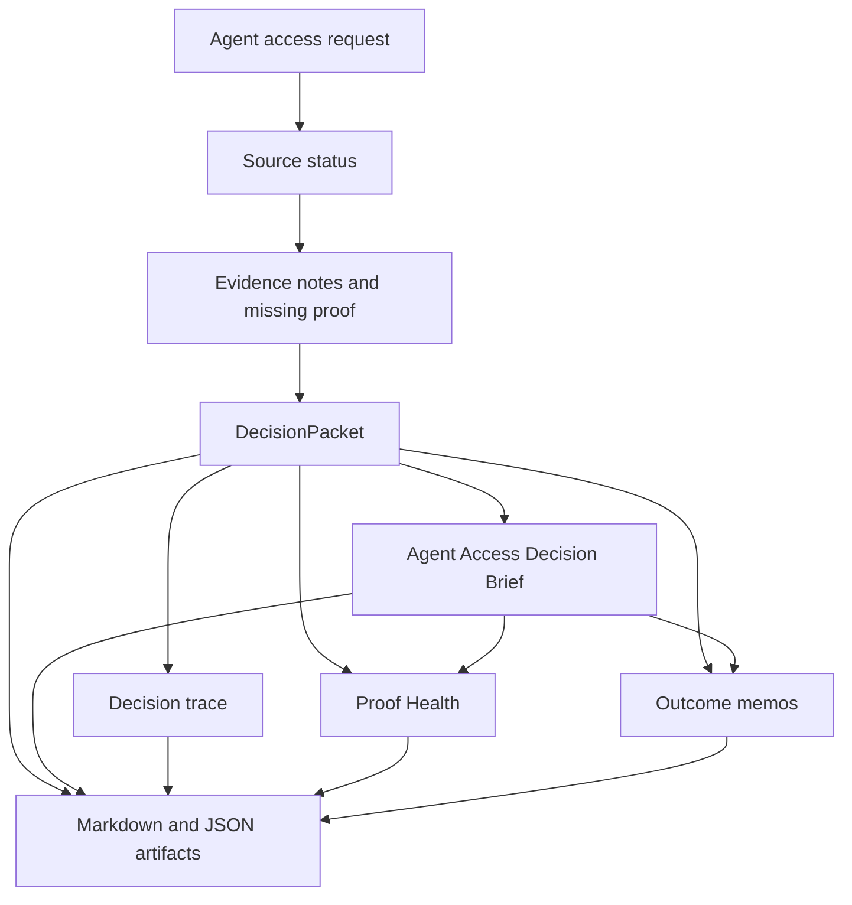

# Architecture

Status: public build map
Purpose: show how the repo is structured so engineering can extend it without exposing private v1 code

## System Shape



The packet is the canonical object. The brief, Proof Health report, outcome memos, trace, and Markdown outputs are projections.

## Module Map

| Module | Responsibility | Extension rule |
| --- | --- | --- |
| `agent/demo.py` | Runs the public demo and writes artifacts. | Keep no-key mode deterministic; add live behavior behind `IA_LIVE_MODE=1`. |
| `agent/skills.py` | Stores the canonical public Agent Skills registry and renders human/JSON projections. | Add public capability claims here first, with commands, artifacts, dependencies, and safety boundaries. |
| `agent/packet.py` | Builds the canonical DecisionPacket and trace. | Add fields through schema-backed packet changes. |
| `agent/decision_brief.py` | Derives the Agent Access Decision Brief from the packet. | Never add separate approval logic here; derive from packet state. |
| `agent/outcome_memo.py` | Derives the packet-level meeting decision from the public packet, brief, policy gate, Proof Health, and sponsor readiness. | Keep it a projection; it must not approve access or grant permissions. |
| `agent/trial_outcome_memo.py` | Derives the design-partner meeting decision from the public trial bundle. | Keep it tied to the trial request, packet, and brief; it must not approve, grant, write, or mutate. |
| `agent/proof_health.py` | Derives Packet Drift, stale assumptions, expired reviewer gates, and next human health check from the public packet and brief. | Keep it lifecycle-only; it must not approve, grant, write, or mutate production state. |
| `agent/renderers.py` | Renders packet, trace, and brief to Markdown. | Keep rendering deterministic and side-effect free. |
| `agent/runtime.py` | Optional Nebius/OpenClaw live runtime. | Live output should enrich packet artifacts and preserve safety invariants. |
| `agent/tools.py` | Tavily/Composio/tool adapters. | Prefer explicit safe helpers over generic write-capable actions. |
| `schemas/` | JSON contracts for public artifacts. | Any contract change needs tests and regenerated examples. |
| `tests/` | Safety and artifact regression checks. | Add tests before expanding live permissions. |

## Data Flow

1. A user asks whether an agent should receive access.
2. The harness records source status and requested capability.
3. Evidence notes, missing proof, and blocked claims are separated.
4. The DecisionPacket sets approval posture and safety state.
5. The Agent Access Decision Brief derives a skim-ready go/no-go.
6. Outcome memos derive meeting decisions without changing the access decision.
7. The Proof Health report derives lifecycle drift status without changing the access decision.
8. Renderers write Markdown and JSON artifacts.
9. Tests and CI verify no-key execution and safety defaults.

## Stable Contracts

The current public contracts are:

- `schemas/decision_packet.schema.json`
- `schemas/agent_access_decision_brief.schema.json`
- `examples/generated/support_triage_agent.packet.json`
- `examples/generated/support_triage_agent.decision_brief.json`
- `examples/generated/support_triage_agent.trace.json`
- `examples/generated/support_triage_agent.proof_health.json`
- `examples/generated/support_triage_trial.outcome_memo.json`

Generated JSON should stay machine-readable and stable enough for AI judges to parse.

## Extension Seams

| Seam | Adds value by | Must not |
| --- | --- | --- |
| Tavily evidence adapter | Adding source URLs, freshness, and current context to `evidence_notes`. | Convert search results into automatic approval truth. |
| Nebius narration adapter | Turning packet state into reviewer-ready language. | Mutate safety fields or invent missing proof. |
| Composio dry-run planner | Producing scoped GitHub/Slack/Jira action plans. | Execute writes in the default public path. |
| OpenClaw runtime trace | Recording live agent steps and tool-call decisions. | Hide failed/blocked steps from the trace. |

## Safety Boundary

The public harness proves that InferenceAtlas prepares access review artifacts. It does not prove production authorization.

The architecture must preserve:

- packet before action
- evidence before approval
- blocked claims before confident language
- human reviewer gates before access grants
- dry-run Composio before external mutation

## Private V1 Boundary

The private product can contain richer extraction, evidence, routing, UI, reviewer queues, and audit stores. This public repo should expose the contracts and proof artifacts only:

```text
private engine, public proof
```
