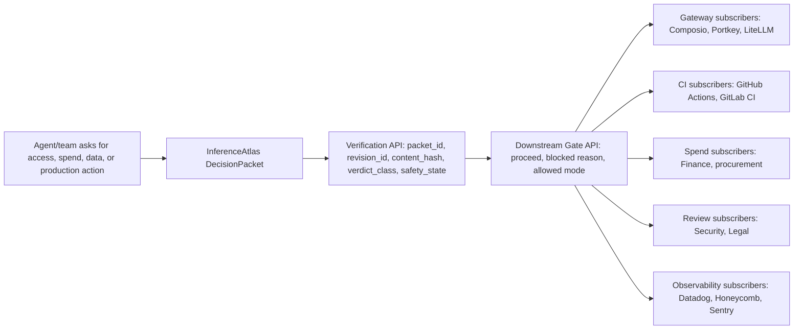

# Public Conformance Contract

Before an AI agent receives access to tools, data, spend, or production systems, a pre-permission proof packet should exist. This document defines the public conformance contract for that packet: what must be shown, what must stay blocked, what evidence must remain visible, and how reviewer gates are represented. InferenceAtlas v1 implements a private canonical engine. This public contract is the minimum proof surface every agent-access review implementation can be measured against. Private engine, public proof.

## Contract Role

This contract is the public authority document for the repo.

It defines the minimum review surface a judge, CTO, Security lead, AI platform owner, or design partner should expect before an agent moves toward tool access, sensitive data access, vendor spend, or production systems.

It does not define the private InferenceAtlas v1 implementation, private prompts, production routing, private reviewer queues, customer policies, or account-specific approval maps.

InferenceAtlas is the packet authority layer upstream of tools, gateways, spend controls, CI, and human review.

The packet authority layer downstream systems trust before AI moves.

AI movement is cross-functional. IA turns every team's proof into one packet downstream systems can trust.



The contract is intentionally narrow:

- humans can inspect it
- AI reviewers can follow it
- CI can validate it
- sponsor adapters can enrich it safely
- private v1 internals remain private

## Packet Verification API

The public web harness exposes a read-only verification surface:

```text
GET /api/packets/{scenario_or_packet_id}/verification
```

The endpoint returns the same packet authority fields that generated artifacts and downstream subscriber examples consume:

- `packet_id`
- `snapshot_id`
- `revision_id`
- `content_hash`
- `verdict_class`
- `safety_state`
- `blocked_claims`
- `missing_proof`
- `reviewer_owners`
- `next_human_action`

The verification endpoint is read-only by protocol. It does not approve access, grant permissions, mutate packet state, execute writes, reduce proof debt, or override the deterministic packet verdict.

## Downstream Gate Decision API

Downstream systems can ask whether a requested agent action may proceed:

```text
GET /api/downstream-gates/{subscriber}/decision
```

The response is derived from Packet Authority verification. It names `requested_action_can_proceed`, `access_or_spend_movement_allowed`, `decision`, `allowed_mode`, `blocked_reason`, `safe_next_step`, and the packet reference used to answer.

The gate may return a read-only review or audit route, but it must not approve access, grant permissions, authorize spend, execute writes, mutate packet state, or trust raw agent intent.

## Downstream Subscribers

Subscriber examples live under category folders:

```text
examples/subscribers/
```

Each subscriber receives the same packet authority shape and asks a different downstream question:

| Category | Example question |
| --- | --- |
| Gateway | Can a tool or model gateway execute this requested action? |
| CI | Can a workflow deploy, merge, or modify production using this agent? |
| Spend | Can Finance treat this as approved vendor, model, token, or tool spend? |
| Review | Which human reviewer queue must inspect this packet before access moves? |
| Observability | What packet authority object should be attached to audit telemetry? |

Subscribers may consume packet authority. They cannot become packet authority.

## Public Packet Contract

A conforming public packet must show the decision context, requested access, proof debt, reviewer routing, and safety state without approving production access.

The public packet must include:

| Public surface | What it proves |
| --- | --- |
| Decision context | The request question, verdict, review posture, and original request are preserved before recommendation language appears. |
| Approval posture | Production, validation, read, write, and compliance posture are separated instead of collapsed into a generic approve or deny. |
| Requested capability | Each requested system/action is named with a public risk level and default demo state. |
| Tool access plan | Allowances, blocked actions, and required proof are visible for each tool. |
| Tool and data scope | Read surfaces, draft-only surfaces, blocked write/admin/production surfaces, and role-level data classes are explicit. |
| Blocked claims | Claims that cannot be made without proof remain visible. |
| Missing proof | Evidence or reviewer confirmation required before access can move is owner-routed. |
| Reviewer owners and actions | Security, Engineering, Ops, Legal, Finance, or other reviewers have concrete work, not vague sign-off language. |
| Next validation | The smallest safe validation step is named before production access. |
| Safety state | Access approval, external writes, production mutation, packet mutation, dry-run state, and human approval requirements are explicit. |

## Public Brief Contract

A conforming public brief must turn the packet into a skim-ready access decision.

The public brief must include:

| Public surface | What it proves |
| --- | --- |
| Reviewer-facing decision | The brief gives a concise verdict, next step, and reason. |
| Go/no-go state | Production access, scoped validation, external writes, dry-run state, and next validation are visible. |
| Access eligibility | Each requested system shows eligibility, risk, validation allowance, production status, and required proof. |
| Access envelope | The brief separates what can move in validation from what stays blocked. |
| Reviewer gates | Required gates name the reviewer owner, gate, blocked surface, and when the gate is required. |
| Safety state | The brief repeats the same safety defaults as the packet. |

## What Must Be Shown

Every conforming implementation must show:

- what the agent is asking to access
- which systems, tools, and actions are in scope
- which data classes may be touched
- which write, admin, production, spend, or sensitive-data surfaces stay blocked
- what evidence is missing
- which claims are unsupported
- who owns each review gate
- what next validation can happen safely
- whether sponsor adapters would execute or approve anything
- whether human approval is still required

## What Must Stay Blocked

The public contract requires these defaults:

- production access stays blocked
- external writes stay disabled
- Composio stays dry-run by default
- human approval remains required
- packet state mutation stays disabled
- unsupported approval, readiness, compliance, savings, quality, latency, or access claims remain blocked
- missing proof remains visible
- reviewer gates remain explicit
- sponsor adapters cannot approve access or grant permissions

A conforming implementation can recommend scoped validation only when the validation stays inside this blocked-production, no-write, human-reviewed envelope.

## Reviewer Gates

Reviewer gates must be represented as work that named owner roles can act on.

A gate should show:

- owner role
- review area
- current state
- action required
- surface blocked by the action
- when the action is required

Examples of owner roles include Security, Engineering, Support Ops, Legal, Procurement, Finance, Data/Analytics, and Engineering Leadership.

The contract prefers owner roles over private people names. This keeps public artifacts reviewable without exposing private org charts or account context.

## Proof Health Contract

A conforming public lifecycle report must show when a pre-permission packet is current, drifting, or stale without changing the original access decision.

The public lifecycle surface must include:

| Public surface | What it proves |
| --- | --- |
| Overall health status | The packet can be reviewed as current, drifting, or stale without implying access approval. |
| Packet Drift timeline | Tool scope, data boundaries, reviewer gates, and proof freshness are checked across visible checkpoints. |
| Stale assumptions | Assumptions that need reviewer refresh remain explicit before validation expands. |
| Expired reviewer gates | Review work that has aged out is named with the human refresh action required. |
| Next human health check | The next reviewer action is explicit before access moves. |
| Safety boundary | The lifecycle report cannot approve, grant, write, or mutate production state. |

The Proof Health command is:

```bash
python3 -m agent.proof_health
```

Expected public artifacts:

```text
examples/generated/support_triage_agent.proof_health.md
examples/generated/support_triage_agent.proof_health.json
```

## Conformance

The repo exposes a runnable conformance check.

Validate all registered scenarios:

```bash
python3 -m agent.contract --all
```

Validate checked-in generated artifacts:

```bash
python3 -m agent.contract --all --generated-dir examples/generated
```

Expected output:

```text
Public contract: agent_access_public.v0
- support_triage_agent: OK
- read_only_analytics_agent: OK
- admin_code_fix_bot: OK
```

The conformance check proves that the generated packet and access brief preserve the public surface, keep production access blocked, keep dry-run defaults intact, and keep reviewer gates visible.

## Sponsor Adapter Boundary

Sponsor adapters may enrich the public review surface, but they cannot own the access verdict.

| Adapter | Allowed public output | Forbidden default behavior |
| --- | --- | --- |
| Tavily | Evidence notes or evidence candidates. | It must not approve access. |
| Composio | Tool scope, blocked actions, and dry-run action plans. | It must not execute writes or grant permissions by default. |
| Nebius | Narration or summary projections. | It must not own verdicts, safety state, or blocked claims. |
| OpenClaw | Trace steps with blocked/allowed outcomes. | It must not hide blocked attempts or mutate production state. |

## Sponsor Live Readiness

A conforming public readiness report must show whether sponsor integrations are contract-ready for live enrichment without requiring keys in the default path.

The readiness surface must show:

- provider name
- live value
- visible output artifacts
- next CTO setup step
- whether the default path requires keys
- whether the provider can execute, approve, grant, or mutate state
- whether human review remains required

Run:

```bash
python3 -m agent.sponsor_readiness
```

Expected public artifacts:

```text
examples/generated/sponsor_live_readiness.md
examples/generated/sponsor_live_readiness.json
```

## Private Boundary

The public contract must not expose:

- private v1 source code
- private prompts
- private reviewer queues
- production routing logic
- customer or workspace context
- live sponsor tokens
- account-specific tool grants
- internal product vocabulary that is not required for public review

The bridge is:

```text
private v1 engine
-> public conformance projection
-> public repo artifacts, CLI, and demo
```

The bridge is not:

```text
public repo = private v1 source
```

Private engine, public proof.
