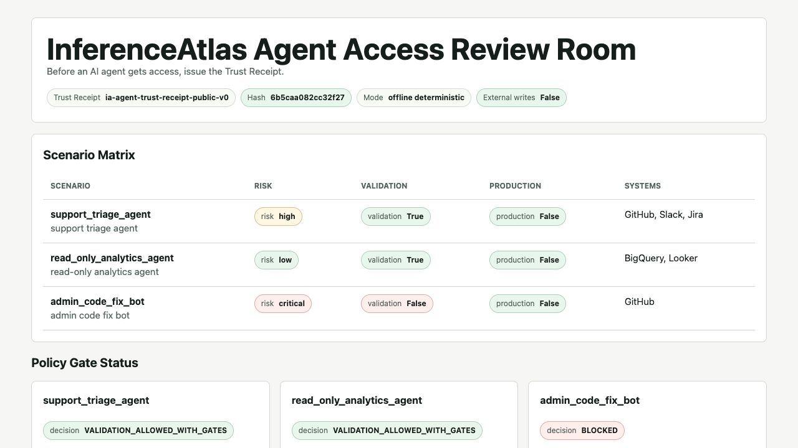

# Review Room Walkthrough

Status: public demo talk track
Purpose: help a founder, CTO, judge, or AI reviewer understand the Agent Access Review Room in 60-90 seconds without exposing private v1 source

## Visual Anchor



Open the static Review Room when recording or reviewing locally:

```bash
python3 -m agent.trust
python3 -m agent.review_room
```

Then open:

```text
examples/generated/review_room.html
```

The screenshot is checked in so a skim reviewer can understand the surface even before running commands.

Private engine, public proof.

## Talk Track

InferenceAtlas is a pre-permission control plane for AI agent access. Before an agent gets tools, data, spend, or production permissions, IA issues a Trust Receipt and Review Room showing what can move, what stays blocked, what proof is missing, who must review, and what validation comes next.

The key product signal is that the same engine bends across risk levels:

- `read_only_analytics_agent` stays low-risk and can move into read-only validation with gates.
- `support_triage_agent` can move into scoped validation, but production access and write actions stay blocked.
- `admin_code_fix_bot` is blocked because admin and production-write scopes are too risky for the public validation path.

This is not a runtime permission pop-up. Runtime prompts ask whether an agent may perform one action now. InferenceAtlas asks whether the agent should be eligible for this class of access at all, and what proof is required before that access can move.

## What To Point At

1. Scenario Matrix: shows verdict spread across low, high, and critical risk.
2. Policy Gate Status: shows critical/admin/prod-write access is blocked by policy.
3. Sponsor Adapter Status: shows Composio, Tavily, Nebius, and OpenClaw enter as dry-run or evidence contracts.
4. Permission Envelope: separates validation allowances from blocked production or write surfaces.
5. Proof Debt and Reviewer Routing: turns vague risk into named owner work.
6. Private Boundary: confirms the public repo is proof surface, not private v1 source exposure.

## Recording Checklist

- Keep the browser on `examples/generated/review_room.html`.
- Show the top of the Review Room first; do not start in source code.
- Run the no-key commands if there is time:

```bash
python3 -m agent.demo
python3 -m agent.review --list
python3 -m agent.gate --all
python3 -m agent.adapters --all
python3 -m agent.trust
python3 -m agent.review_room
python3 -m unittest discover -s tests
```

- Do not show API keys, `.env`, private prompts, customer context, private v1 source, or live sponsor tokens.
- If live mode is shown later, frame it as enrichment only; the deterministic packet, policy gate, blocked claims, and safety state remain the authority.

## Design Partner Signal

The pilot ask is simple: pick one agent-access workflow, run it through the Trust Receipt, and validate whether Security, Engineering, Legal, Ops, and Finance can review access faster with less ambiguity.

The public demo proves the contract. A design partner validates the workflow on real internal access requests.

For the trial shape, use `docs/DESIGN_PARTNER_BRIEF.md`.

For the fillable request shape, use `docs/DESIGN_PARTNER_TRIAL_KIT.md` and `examples/requests/design_partner_trial.yml`.
